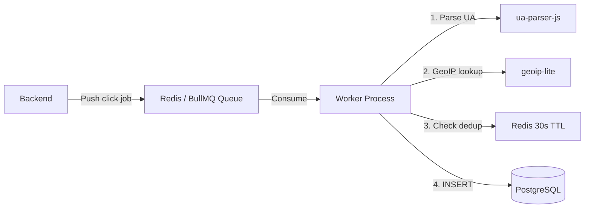

# dev.ly — Analytics Service

The analytics microservice for **dev.ly**. Ingests click events, enriches them with geolocation and device data, and serves aggregate analytics via a stats API. Powered by a **BullMQ** worker pipeline for reliable event processing.

---

## ✨ Features

- **Click Ingestion** — Accepts raw click events via REST or BullMQ queue
- **Data Enrichment** — Extracts browser, OS, and device type from User-Agent (ua-parser-js)
- **GeoIP Lookup** — Resolves IP addresses to country/city (geoip-lite)
- **UTM Tracking** — Parses `utm_source`, `utm_medium`, `utm_campaign` from query params
- **Click Deduplication** — Marks duplicate clicks (same IP + URL within 30s) as `is_unique: false`
- **BullMQ Worker** — Background job processor for reliable, decoupled event handling
- **Stats API** — Aggregate stats, per-URL detail, and 7-day time series

---

## 🛠 Tech Stack

| Technology | Purpose |
|---|---|
| [Express 5](https://expressjs.com) | HTTP framework |
| [PostgreSQL 15](https://postgresql.org) | Analytics data store |
| [Redis 7](https://redis.io) | Job queue broker & dedup cache |
| [BullMQ](https://bullmq.io) | Background job processing |
| [ua-parser-js](https://github.com/nicedoc/UAParser.js) | User-Agent parsing |
| [geoip-lite](https://github.com/bluesmoon/node-geoip) | IP → Geo lookup |
| [request-ip](https://github.com/pbojinov/request-ip) | Client IP extraction |

---

## 📁 Project Structure

```
analytics/
├── index.js                         # API entry point
├── Dockerfile                       # Docker build
├── package.json
└── src/
    ├── config/
    │   ├── db.js                    # PostgreSQL pool
    │   └── redis.js                 # Redis/IORedis client
    ├── controllers/
    │   └── analyticsController.js   # Log, Stats, URL detail
    ├── middlewares/
    │   └── authenticateToken.js     # JWT verification
    ├── routes/
    │   └── analyticsRoutes.js       # /api/* routes
    ├── utils/
    │   └── enrich.js                # Geo + device enrichment logic
    └── workers/
        └── worker.js                # BullMQ consumer — processes click jobs
```

---

## 🔌 API Endpoints

| Method | Endpoint | Auth | Description |
|---|---|---|---|
| `POST` | `/api/log` | ✗ | Ingest a raw click event |
| `GET` | `/api/stats` | ✓ | Get user's aggregate analytics |
| `GET` | `/api/stats/urls-series` | ✓ | Get 7-day time series per URL |
| `GET` | `/api/stats/:id` | ✓ | Get detailed stats for a single URL |

### Click Event Payload (`POST /api/log`)

```json
{
  "url_id": 42,
  "ip": "203.0.113.1",
  "user_agent": "Mozilla/5.0 ...",
  "referrer": "https://twitter.com",
  "utm_source": "twitter",
  "utm_medium": "social",
  "utm_campaign": "launch"
}
```

### Enriched Analytics Record

Each click is enriched before storage:

| Field | Source |
|---|---|
| `browser`, `os`, `device_type` | ua-parser-js |
| `country`, `city` | geoip-lite |
| `utm_source`, `utm_medium`, `utm_campaign` | Query params |
| `is_unique` | Redis dedup (30s window) |

---

## ⚙️ Worker Pipeline

The BullMQ worker (`src/workers/worker.js`) runs as a separate process:



Run the worker independently:

```bash
node src/workers/worker.js
```

Or via Docker Compose (configured in the main repo):

```bash
docker-compose up worker
```

---

## 🚀 Getting Started

### Prerequisites

- Node.js 18+
- PostgreSQL 15+ (with analytics tables — migrations run from the backend service)
- Redis 7+

### Install & Run

```bash
# Start the API server
npm install
node index.js

# In a separate terminal, start the worker
node src/workers/worker.js
```

The API starts on port `5002` (default).

### Environment Variables

Create a `.env` file:

```env
PORT=5002
DB_USER=postgres
DB_PASSWORD=postgres
DB_HOST=localhost
DB_NAME=devly
DB_PORT=5432
JWT_SECRET=supersecretkey_change_me_in_prod
REDIS_URL=redis://localhost:6379
```

> **Docker:** Use `DB_HOST=db` and `REDIS_URL=redis://redis:6379`

---

## 🔗 Related Repos

| Repo | Description |
|---|---|
| [dev.ly](https://github.com/dk-a-dev/dev.ly) | Main repo (system design & orchestration) |
| [dev.ly-frontend](https://github.com/dk-a-dev/dev.ly-frontend) | Next.js dashboard |
| [dev.ly-backend](https://github.com/dk-a-dev/dev.ly-backend) | URL shortener API |

---

## 📝 License

MIT
